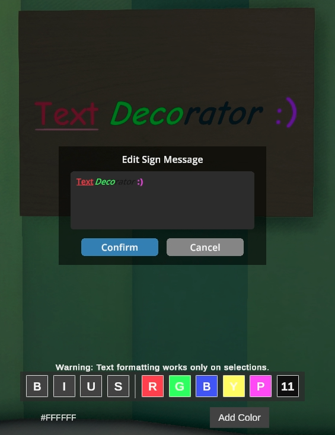

# TextDecorator

Adds text decoration options to your signs.

## Installation
1. Install MelonLoader
2. Extract the zip file
3. Place the dll file into the Mods directory for your branch
   - For none/beta use IL2CPP
   - For alternate/alternate beta use Mono
4. Launch the game

GUI appears when editing a sign. Custom colors are persistent in session (but not saved across sessions).
Currently, only selections can be formatted.

Can possibly work with other text fields (like from other mods), go ahead and try it out!
